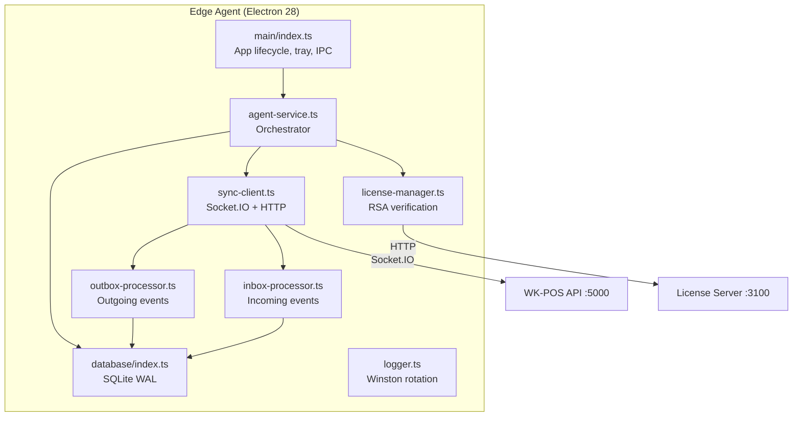

# WK POS Enterprise — Edge Agent Hardening Audit

**Date:** 2026-02-16  
**Author:** Enterprise Readiness Audit (Phase 4)  
**Classification:** INTERNAL — Agent Security & Reliability  
**Status:** GAPS IDENTIFIED — 11 items, 3 P0

---

## 1. Architecture Overview

The WK-Edge Agent is a headless Electron 28 application that enables offline-first POS operation with SQLite (WAL mode) as the local datastore and Socket.IO for server synchronization.

**15 source files, ~2,293 lines total.**

---

## 2. What Works Well

| Feature | Implementation | Status |
|---------|---------------|--------|
| SQLite WAL mode | Properly configured with `journal_mode=WAL`, `synchronous=NORMAL`, `foreign_keys=ON` | ✅ |
| Outbox persistence | Events written to SQLite BEFORE sync attempt | ✅ |
| Push checksums | SHA-256 per entry + SHA-256 per batch | ✅ |
| Idempotency keys | `{branchId}:{deviceId}:{localSequence}` — deterministic, monotonic | ✅ |
| Pull deduplication | `event_id` check in inbox table | ✅ |
| Anti-echo filter | Skip events where `originDeviceId === myDeviceId` | ✅ |
| DUPLICATE ack handling | Server rejects as DUPLICATE → agent marks SYNCED (not FAILED) | ✅ |
| Offline grace period | 72-hour configurable window | ✅ |
| License RSA verification | SHA-256 signature validation (when key is configured) | ✅ |
| Single-instance lock | Prevents multiple agent instances | ✅ |
| Log rotation | 5MB error, 10MB combined, Winston | ✅ |
| CSP-safe HTML | Proper Content-Security-Policy on renderer pages | ✅ |

---

## 3. Hardening Gaps

### P0 — Critical Security Issues

#### EA-001: Static Auth Token in Plain File

| Field | Value |
|-------|-------|
| Location | `agent-config.json` → `sync-client.ts L62-63` |
| Issue | Auth token stored in plain JSON file on disk. No rotation, no expiration, no JWT. |
| Impact | Token theft allows full impersonation of the edge agent — inject sales, modify stock, exfiltrate data |
| Fix | 1) Use `keytar` (already in deps but unused) for OS credential storage. 2) Implement JWT with refresh token rotation. 3) Add device certificate for machine-level identity. |

#### EA-002: Branch Binding Is Config-Only

| Field | Value |
|-------|-------|
| Location | `agent-config.json` → passed as query param in Socket.IO |
| Issue | Branch ID is a client-side config value with no server validation. Any value can be set. |
| Impact | Rogue agent can impersonate any branch — inject sales into wrong branch |
| Fix | 1) Server validates `deviceId → branchId` binding on every sync. 2) Embed `branchId` in device activation/license token. 3) Cryptographic binding: branch ID in signed per-device token. |

#### EA-003: Dead-Letter Handling is Absent

| Field | Value |
|-------|-------|
| Location | `outbox-processor.ts` |
| Issue | `DEAD_LETTER` status type exists but is NEVER SET. Failed entries accumulate forever with no alerting, no retry API, no export. |
| Impact | Permanently failed transactions are silently lost — potential revenue leakage |
| Fix | 1) After `max_attempts`, explicitly set `status = 'DEAD_LETTER'`. 2) Emit IPC event for tray notification. 3) Expose dead-letter list in status UI with "Retry" and "Export" buttons. 4) Log at ERROR level. |

---

### P1 — Data Integrity Issues

#### EA-004: Pre-Ack Attempt Increment

| Field | Value |
|-------|-------|
| Issue | `markAttempted()` increments attempt count BEFORE server ack. Crash between mark and ack inflates count. Enough crashes = premature `max_attempts` exhaustion. |
| Fix | Mark attempt only when ack is received (success or failure). On startup, reset entries stuck in `IN_PROGRESS` state back to `PENDING`. |

#### EA-005: No Incoming Packet Checksum Validation

| Field | Value |
|-------|-------|
| Location | `inbox-processor.ts` |
| Issue | Incoming sync packets have a `checksum` field but it's never verified |
| Fix | Verify `SHA256(JSON.stringify(payload)) === packet.checksum` before processing |

#### EA-006: No License Gate on Local Events

| Field | Value |
|-------|-------|
| Issue | `recordEvent()` accepts events even after license expires |
| Fix | Check `licenseManager.isValid()` before accepting new events. After grace period, reject with clear error. |

#### EA-007: No Full Resync Mechanism

| Field | Value |
|-------|-------|
| Issue | After long offline period, the agent continues from `last_pulled_sequence`. If server purged old events, this creates data gaps. |
| Fix | Implement "resync watermark": on reconnect, check server's `minAvailableSequence`. If `last_pulled_sequence < minAvailableSequence`, trigger full data refresh. |

---

### P2 — Reliability Issues

#### EA-008: No WAL Checkpoint on Shutdown

| Field | Value |
|-------|-------|
| Issue | `closeDatabase()` never calls `PRAGMA wal_checkpoint(TRUNCATE)` |
| Fix | Add checkpoint call in the database close function |

#### EA-009: No Incoming Data Schema Validation

| Field | Value |
|-------|-------|
| Issue | Any JSON payload is accepted from the server inbox — no schema validation |
| Fix | Define Zod/JSON Schema for sync payloads, validate before processing |

#### EA-010: 4 Dead Dependencies

| Package | Status |
|---------|--------|
| `electron-store` | In deps but never imported |
| `axios` | In deps but code uses `fetch` |
| `uuid` | In deps but code uses `ulid` |
| `node-cron` | In deps but never imported |

**Fix:** Remove from `package.json` to reduce supply chain attack surface.

---

### P3 — Minor

#### EA-011: No Startup Recovery for In-Flight Entries

| Field | Value |
|-------|-------|
| Issue | Entries stuck in `IN_PROGRESS` state after crash are not reset on boot |
| Fix | On startup: `UPDATE outbox SET status = 'PENDING' WHERE status = 'IN_PROGRESS'` |

---

## 4. Remediation Priority Matrix

| # | Issue | Severity | Effort | Sprint |
|---|-------|----------|--------|--------|
| EA-001 | Static auth token | **P0** | Medium | Sprint 1 |
| EA-002 | Branch binding | **P0** | Medium | Sprint 1 |
| EA-003 | Dead-letter handling | **P0** | Small | Sprint 1 |
| EA-004 | Pre-ack attempt count | **P1** | Small | Sprint 1 |
| EA-005 | Packet checksum validation | **P1** | Small | Sprint 2 |
| EA-006 | License gate on events | **P1** | Small | Sprint 2 |
| EA-007 | Full resync mechanism | **P1** | Medium | Sprint 2 |
| EA-008 | WAL checkpoint | **P2** | Trivial | Sprint 2 |
| EA-009 | Schema validation | **P2** | Small | Sprint 3 |
| EA-010 | Dead dependencies | **P2** | Trivial | Sprint 1 |
| EA-011 | Startup recovery | **P3** | Trivial | Sprint 2 |

---

*End of Edge Agent Hardening Audit — Phase 4 deliverable*
