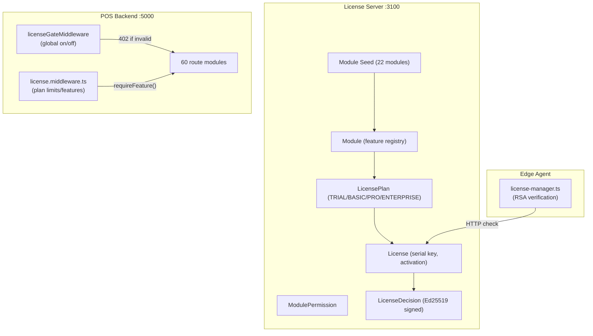

# WK POS Enterprise — License Alignment Audit

**Date:** 2026-02-16  
**Author:** Enterprise Readiness Audit (Phase 5)  
**Classification:** INTERNAL — License & Revenue  
**Status:** CRITICAL GAPS — 38 of 60 modules ungated

---

## 1. Executive Summary

The license system has solid infrastructure (RSA/Ed25519 signing, Stripe billing, device activation, offline tokens) but **critical alignment gaps** between the license module registry and the actual backend modules:

- **22 modules seeded** in the license server
- **60 modules exist** in the backend
- **38 modules (63.3%) operate without any license tier restriction**
- A TRIAL or BASIC user gets access to Enterprise-tier features like CRM, Report Builder, ABAC, Webhooks

For a product priced at $6,000–$9,000, this represents **significant revenue leakage**.

---

## 2. License Architecture



### Enforcement Flow

```
Request
  → licenseGateMiddleware (global binary gate)
      ├── SKIP_LICENSE_CHECK=true → bypass ALL (⚠️)
      ├── ALWAYS_ALLOWED: /health, /auth/*, /license/* → pass
      ├── license valid → proceed
      └── no license → 402 "LICENSE_REQUIRED"
  → Individual routes
      ├── requireFeature('featureName') → check plan features
      ├── enforcePlanLimit('resource') → check count vs limits
      └── Most routes: NO per-module check (⚠️)
```

---

## 3. Module Registry Gap Analysis

### 3.1 Seeded Modules (22)

| # | Code | Name | Category | Tier |
|---|------|------|----------|------|
| 1 | `pos` | Point of Sale | core | ALL |
| 2 | `products` | Products | core | ALL |
| 3 | `categories` | Categories | core | ALL |
| 4 | `customers` | Customers | core | ALL |
| 5 | `invoices` | Invoices | core | ALL |
| 6 | `exchanges` | Exchanges & Returns | core | ALL |
| 7 | `suppliers` | Suppliers | inventory | BASIC+ |
| 8 | `reports` | Reports | analytics | BASIC+ |
| 9 | `stocktaking` | Stock Taking | inventory | BASIC+ |
| 10 | `stock_transfers` | Stock Transfers | inventory | BASIC+ |
| 11 | `accounting` | Accounting | finance | PRO+ |
| 12 | `users` | User Management | admin | ALL |
| 13 | `branches` | Branch Management | admin | PRO+ |
| 14 | `settings` | Settings | admin | ALL |
| 15 | `coupons` | Coupons & Promotions | marketing | BASIC+ |
| 16 | `loyalty` | Loyalty Program | marketing | PRO+ |
| 17 | `shifts` | Shift Management | hr | BASIC+ |
| 18 | `attendance` | Attendance | hr | BASIC+ |
| 19 | `hr` | HR Management | hr | PRO+ |
| 20 | `website_sync` | Website Sync | integrations | ENTERPRISE |
| 21 | `eta` | ETA (Tax Authority) | compliance | PRO+ |
| 22 | `api` | API Access | integrations | PRO+ |

### 3.2 Backend Modules NOT in License Registry (38)

| # | Module | Recommended Tier | Recommended License Code |
|---|--------|-----------------|-------------------------|
| 1 | `admin` | ALL | (implied by `settings`) |
| 2 | `api-keys` | PRO+ | `api` (merge) |
| 3 | `approvals` | ENTERPRISE | `approvals` |
| 4 | `audit` | PRO+ | `audit` |
| 5 | `auth` | ALL | ALWAYS_ALLOWED |
| 6 | `barcode` | ALL | (implied by `pos`) |
| 7 | `batch` | BASIC+ | (implied by `products`) |
| 8 | `commissions` | PRO+ | `commissions` |
| 9 | `compliance` | PRO+ | (merge with `eta`) |
| 10 | `concurrency` | ALL | INFRASTRUCTURE |
| 11 | `crm` | ENTERPRISE | `crm` |
| 12 | `custom-fields` | PRO+ | `custom_fields` |
| 13 | `customer-groups` | BASIC+ | (implied by `customers`) |
| 14 | `dashboard` | ALL | (implied by `settings`) |
| 15 | `discounts` | BASIC+ | `discounts` |
| 16 | `ecommerce` | ENTERPRISE | `ecommerce` |
| 17 | `employees` | BASIC+ | (implied by `hr`) |
| 18 | `feature-flags` | ALL | INFRASTRUCTURE |
| 19 | `giftcards` | PRO+ | `giftcards` |
| 20 | `hardware` | ALL | (implied by `pos`) |
| 21 | `hr-payroll` | ENTERPRISE | `payroll` |
| 22 | `integrations` | PRO+ | `integrations` |
| 23 | `inventory` | ALL | (implied by `products`) |
| 24 | `items` | ALL | (implied by `products`) |
| 25 | `mfa` | ALL | ALWAYS_ALLOWED |
| 26 | `modifiers` | BASIC+ | (implied by `products`) |
| 27 | `network` | ALL | INFRASTRUCTURE |
| 28 | `notifications` | BASIC+ | `notifications` |
| 29 | `parked-sales` | ALL | (implied by `pos`) |
| 30 | `payments` | ALL | (implied by `pos`) |
| 31 | `permissions` | ALL | (implied by `users`) |
| 32 | `preferences` | ALL | INFRASTRUCTURE |
| 33 | `printing` | ALL | (implied by `pos`) |
| 34 | `product-tags` | BASIC+ | (implied by `products`) |
| 35 | `purchase-orders` | PRO+ | `purchase_orders` |
| 36 | `rbac` | PRO+ | `rbac` |
| 37 | `report-builder` | ENTERPRISE | `report_builder` |
| 38 | `sales` | ALL | (implied by `pos`) |
| 39 | `sync` | ALL | INFRASTRUCTURE |
| 40 | `tenants` | ALL | INFRASTRUCTURE |
| 41 | `webhooks` | PRO+ | `webhooks` |
| 42 | `websocket` | ALL | INFRASTRUCTURE |

### 3.3 Proposed Canonical Module Registry (36 modules)

After grouping related backend modules, the license registry should have **36 licensable modules**:

| Tier | Modules (count) |
|------|----------------|
| **ALL (core)** | pos, products, categories, customers, invoices, exchanges, users, settings, dashboard (9) |
| **BASIC+** | suppliers, reports, stocktaking, stock_transfers, shifts, attendance, discounts, notifications, coupons (9) |
| **PRO+** | accounting, branches, loyalty, hr, eta, api, audit, commissions, custom_fields, giftcards, purchase_orders, rbac, webhooks, integrations (14) |
| **ENTERPRISE** | website_sync, ecommerce, crm, report_builder, approvals, payroll (6) |
| **INFRASTRUCTURE** (always allowed) | auth, mfa, sync, websocket, concurrency, network, preferences, feature-flags, tenants (9 — not licensed) |

---

## 4. Critical Issues

### L-001: 38 Modules Ungated

| Field | Value |
|-------|-------|
| Severity | **CRITICAL** |
| Impact | TRIAL users can access Enterprise features (CRM, Report Builder, Payroll). Revenue leakage: BASIC customers get PRO+ functionality for free. |
| Fix | 1) Register all 36 licensable modules in seed. 2) Create `requireModule(moduleCode)` middleware. 3) Apply to each route file. |

### L-002: SKIP_LICENSE_CHECK Bypass

| Field | Value |
|-------|-------|
| Severity | **CRITICAL** |
| Location | `license-gate.middleware.ts` |
| Impact | If `SKIP_LICENSE_CHECK=true` in env/config, ALL license enforcement is disabled |
| Fix | Never allow in production: `if (process.env.NODE_ENV === 'production' && SKIP_LICENSE_CHECK) { throw new Error('SKIP_LICENSE_CHECK cannot be enabled in production'); }` |

### L-003: Hardcoded Fallback Limits Mismatch

| Field | Value |
|-------|-------|
| Severity | **HIGH** |
| Location | `license.middleware.ts L48-52` |
| Impact | When license server is unreachable, hardcoded `PLAN_FEATURES` and `PLAN_LIMITS` are used — but they only cover 8 features and disagree with seed values (e.g., TRIAL: middleware says 5 users, seed says 3) |
| Fix | 1) Sync hardcoded fallbacks with seed values. 2) Log WARN when using fallback. 3) Cache last-known-good license for offline use. |

### L-004: Dual Seed Files

| Field | Value |
|-------|-------|
| Severity | **HIGH** |
| Location | `seed-canonical.ts` (22 modules) vs `seed-modules.ts` (9 modules) |
| Impact | Confusion about canonical source of truth. Different module counts and categories. |
| Fix | Delete `seed-modules.ts`. Keep `seed-canonical.ts` as single source, expanded to 36 modules. |

### L-005: Placeholder RSA Key in Edge Agent

| Field | Value |
|-------|-------|
| Severity | **MEDIUM** |
| Location | `license-manager.ts` |
| Impact | Offline license verification is non-functional — RSA public key is a placeholder string |
| Fix | Embed actual RSA-2048 public key from license server config |

### L-006: No Frontend Module Gating

| Field | Value |
|-------|-------|
| Severity | **MEDIUM** |
| Impact | All 57 admin panel pages are visible regardless of license tier. Users see features they haven't paid for. |
| Fix | `useModuleAccess(moduleCode)` hook → conditionally render sidebar items and route guards |

### L-007: No Module Assignment UI

| Field | Value |
|-------|-------|
| Severity | **MEDIUM** |
| Location | Admin panel license pages |
| Impact | Modules can only be assigned to licenses via API or seed scripts — no admin UI |
| Fix | Add module assignment tab to `LicenseDetailsPage` |

### L-008: No Per-Route Module Middleware

| Field | Value |
|-------|-------|
| Severity | **HIGH** |
| Location | All route files |
| Impact | `licenseGateMiddleware` is binary (all or nothing). No per-module gating exists. |
| Fix | Create `requireModule(moduleCode)` middleware, apply per-route. |

---

## 5. Recommended `requireModule` Middleware

```typescript
// license-module.middleware.ts
export function requireModule(moduleCode: string) {
  return async (req: Request, res: Response, next: NextFunction) => {
    const license = await getTenantLicense(req.user.tenantId);
    
    if (!license?.modules?.includes(moduleCode)) {
      return res.status(403).json({
        error: 'MODULE_NOT_LICENSED',
        message: `Your license plan does not include the "${moduleCode}" module.`,
        upgrade: 'Contact sales to upgrade your plan.',
      });
    }
    
    next();
  };
}

// Usage in routes:
router.use(requireModule('crm'));  // Gate entire CRM module
```

---

## 6. Remediation Priority

| # | Fix | Severity | Effort | Sprint |
|---|-----|----------|--------|--------|
| L-001 | Register all 36 modules in seed | **CRITICAL** | Medium | Sprint 1 |
| L-002 | Production guard on SKIP_LICENSE_CHECK | **CRITICAL** | Trivial | Sprint 1 |
| L-008 | Create + apply `requireModule()` middleware | **HIGH** | Large | Sprint 1-2 |
| L-003 | Sync hardcoded fallback with seed | **HIGH** | Small | Sprint 1 |
| L-004 | Delete duplicate seed file | **HIGH** | Trivial | Sprint 1 |
| L-006 | Frontend module gating hook | **MEDIUM** | Medium | Sprint 2 |
| L-007 | Module assignment admin UI | **MEDIUM** | Medium | Sprint 3 |
| L-005 | Embed real RSA key in agent | **MEDIUM** | Trivial | Sprint 2 |

---

*End of License Alignment Audit — Phase 5 deliverable*
