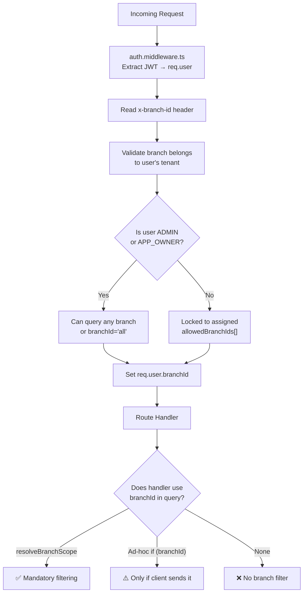
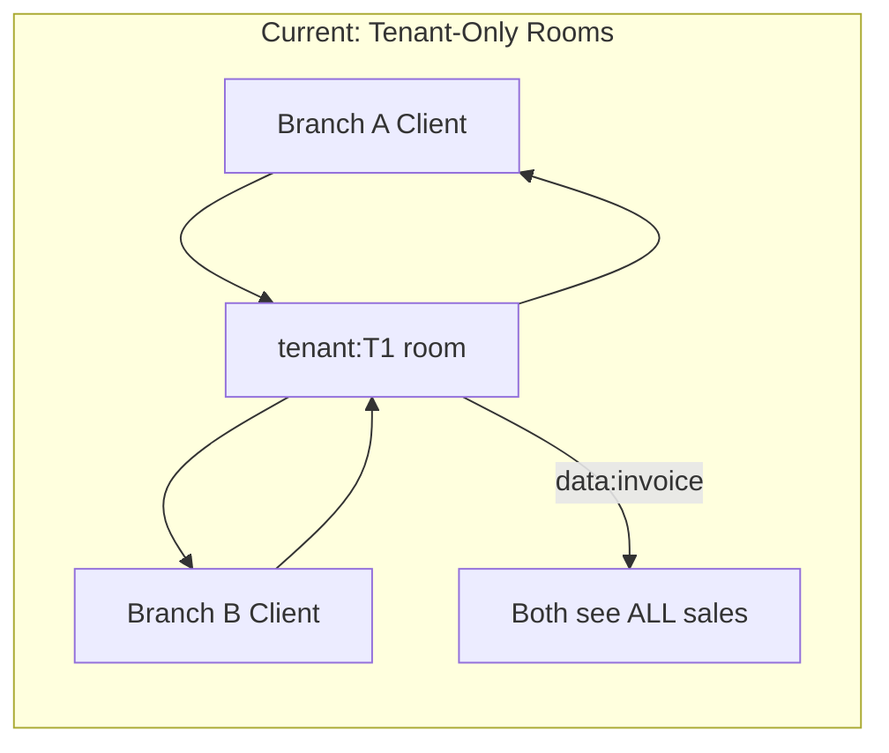
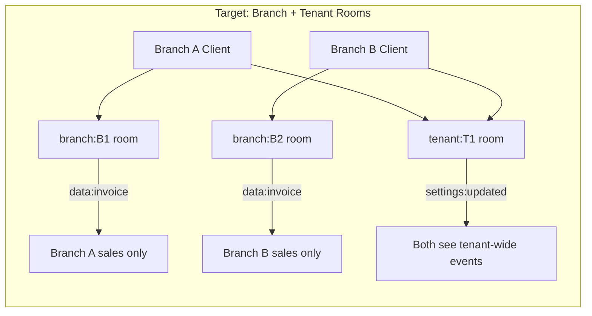

# WK POS Enterprise — Multi-Branch Behavior Audit

**Date:** 2026-02-16  
**Author:** Enterprise Readiness Audit (Phase 3)  
**Classification:** INTERNAL — Branch Isolation Analysis  
**Status:** GAPS IDENTIFIED — Remediation required

---

## 1. Executive Summary

The multi-branch system has a well-designed middleware (`branch-scope.middleware.ts`) and admin panel branch selector (`useBranchStore` + `GlobalContextBar`), but **adoption is inconsistent**:

- Only **1 of 60+ route files** uses the formal `resolveBranchScope` middleware
- All other routes use ad-hoc `if (branchId) where.branchId = branchId` — optional, not enforced
- WebSocket broadcasts are **tenant-scoped only** — Branch A sees Branch B's real-time events
- The `broadcastToBranch()` method exists but is **never called**
- The branch selector is dashboard-only, not global

**18 models** have `branchId` but branch filtering is inconsistent across their route handlers.

---

## 2. Branch Scoping Architecture

### 2.1 How Branch Resolution Works

### 2.2 Middleware Stack

| Middleware | Purpose | Status |
|-----------|---------|--------|
| `auth.middleware.ts` | Extracts `branchId` from JWT payload + `x-branch-id` header | ✅ Working |
| `branch-scope.middleware.ts` | Generates `req.branchScope` Prisma WHERE fragment | ✅ Working but **under-adopted** |
| `tenant-isolation.middleware.ts` | Ensures `tenantId` on all queries | ✅ Working |

---

## 3. Route-Level Audit

### 3.1 Routes with Formal Branch Scoping (✅ Correct)

| Route | Middleware | Status |
|-------|-----------|--------|
| `dashboard.routes.ts` | `router.use(resolveBranchScope)` | ✅ All endpoints branch-scoped |

### 3.2 Routes with Ad-Hoc Branch Filtering (⚠️ Optional)

These routes accept `branchId` as a query parameter but **don't enforce it** — omitting the parameter shows all branches' data:

| Route | Pattern | Mandatory? |
|-------|---------|-----------|
| `sale.routes.ts` | `if (branchId) where.branchId = branchId` | ⚠️ Optional |
| `held-sale.routes.ts` | `if (branchId) where.branchId = branchId` | ⚠️ Optional |
| `accounting.routes.ts` (expenses) | `if (branchId) where.branchId = branchId` | ⚠️ Optional |
| `inventory.routes.ts` | `if (branchId) where.branchId = branchId` | ⚠️ Optional |
| `shift.routes.ts` | `if (branchId) where.branchId = branchId` | ⚠️ Optional on list |
| `purchase-order.routes.ts` | `if (branchId) where.branchId = branchId` | ⚠️ Optional |
| `approval.routes.ts` | `if (branchId) where.branchId = branchId` | ⚠️ Optional |
| `stocktaking.routes.ts` | `if (branchId) where.branchId = branchId` | ⚠️ Optional on list |
| `stock-audit.routes.ts` | `if (branchId) where.branchId = branchId` | ⚠️ Optional |
| `stock-logs.routes.ts` | Query param | ⚠️ Optional on most |
| `report.routes.ts` | Smart filter with `allowedBranchIds` | ✅ Enforced for non-admin |
| `product.routes.ts` | `allowedBranchIds` for stock scoping | ✅ Enforced for non-admin |

### 3.3 Routes with Required Branch on Writes (Mixed)

| Route | Create | List |
|-------|--------|------|
| `serials.routes.ts` | ✅ Required | ⚠️ Optional |
| `reservation.routes.ts` | ✅ Required | ⚠️ Optional |
| `adjustments.routes.ts` | ✅ Required | ⚠️ Optional |
| `stock-transfers.routes.ts` | ✅ Required (from/to) | ⚠️ Optional |
| `printing.routes.ts` | ✅ Required (URL param) | N/A |

### 3.4 Routes with NO Branch Awareness (❌ Missing)

| Route | Concern | Expected? |
|-------|---------|-----------|
| `attendance.routes.ts` | **Zero branchId references** | ❌ Should scope to branch |
| `customer.routes.ts` | No branchId | ✅ Expected — customers are tenant-global |
| `category.routes.ts` | No branchId | ✅ Expected — categories are tenant-global |
| `discount.routes.ts` | No branchId | ⚠️ Depends on business rules |
| `loyalty.routes.ts` | No branchId | ⚠️ Depends on business rules |
| `coupon.routes.ts` | Has `branchIds[]` for applicability but no scoped listing | ⚠️ Partial |
| `giftcard.routes.ts` | No filtering | ⚠️ Depends on business rules |

---

## 4. WebSocket Branch Scoping (Critical Gap)

### Current State

### What Should Happen

### Specific Issues

| Issue | Location | Impact |
|-------|----------|--------|
| Sockets join `tenant:{tenantId}` only | `websocket.service.ts L90` | Branch A sees Branch B events |
| `broadcastToTenant()` used for all events | `websocket.service.ts L141-159` | No branch-level filtering |
| `broadcastToBranch()` exists but never called | `websocket.service.ts L178` | Dead code |
| `getFullSyncData()` ignores branch | `websocket.service.ts` | Full sync returns all branches' stock |

### Fix Required

1. On socket authentication, also join `branch:{branchId}` room
2. Branch-scoped events (sales, stock, shifts) → use `broadcastToBranch()`
3. Tenant-wide events (settings, products, categories) → keep `broadcastToTenant()`
4. `getFullSyncData()` → filter stock levels by requested branch

---

## 5. Admin Panel Branch Selection

### Current State

| Component | Location | Behavior |
|-----------|----------|----------|
| `useBranchStore` (Zustand) | `branch.store.ts` | Persists `activeBranchId` to localStorage, sets `x-branch-id` header |
| `GlobalContextBar` | `GlobalContextBar.tsx` | Branch dropdown UI — **only on DashboardPage** |
| Various pages | Individual pages | Some use `useBranchStore`, some have own local selector |

### Gaps

- `GlobalContextBar` is **not in the global layout** — only DashboardPage
- `AccountingPage` has its **own** `selectedBranch` state (not synced with global store)
- `AttendancePage` has its **own** `clockInBranch` state
- Pages that don't use `useBranchStore` may not send `x-branch-id` header

### Fix Required

1. Move `GlobalContextBar` branch dropdown into the global `Layout` component (sidebar or top bar)
2. Eliminate per-page branch selectors — use `useBranchStore.activeBranchId` everywhere
3. Auto-set branch for single-branch users (hide selector)

---

## 6. Remediation Priority

| # | Fix | Severity | Effort |
|---|-----|----------|--------|
| B-001 | WebSocket: join `branch:{branchId}` rooms, use `broadcastToBranch()` for branch-scoped events | **HIGH** | Medium |
| B-002 | Apply `resolveBranchScope` middleware to all 18 branch-model routes (not just dashboard) | **HIGH** | Medium |
| B-003 | Move branch selector to global layout | **MEDIUM** | Small |
| B-004 | Add branchId to Attendance model + routes | **MEDIUM** | Small |
| B-005 | Filter `getFullSyncData()` stock levels by branch | **MEDIUM** | Small |
| B-006 | Align AccountingPage/AttendancePage to use global `useBranchStore` | **LOW** | Small |
| B-007 | Decide on business rules for tenant-global entities (discounts, loyalty, coupons) | **LOW** | Decision |

---

*End of Multi-Branch Behavior Audit — Phase 3 deliverable*
