# WK POS Enterprise — Sync Protocol Specification

**Date:** 2026-02-16  
**Author:** Enterprise Readiness Audit (Phase 2)  
**Classification:** INTERNAL — Sync Architecture  
**Status:** PROPOSED — Critical gaps identified

---

## 1. Executive Summary

The WK POS system has **6 independent sync layers** that evolved incrementally. This creates overlapping responsibility, inconsistent idempotency enforcement, and 3 separate stock deduction code paths — only 1 of which uses optimistic locking.

**Critical findings:**
- 7 idempotency gaps identified (4 CRITICAL, 3 HIGH)
- 3 stock deduction paths exist; `syncSale` path deducts **zero** stock
- `SyncLog` has no database-level unique constraint — dedup is application-level only
- BullMQ job idempotency key uses `Date.now()` — non-deterministic across retries
- Divamos checkout has **no idempotency protection** at all

---

## 2. Sync Layer Architecture

### 2.1 Layer Overview


### 2.2 Per-Layer Protocol Details

#### Layer 1: WebSocket Real-Time (Socket.IO)

| Property | Value |
|----------|-------|
| Transport | Socket.IO over WebSocket |
| Authentication | JWT token in handshake |
| Room strategy | `tenant:{tenantId}` broadcast |
| Client events | `sync:request` → `SyncChange[]` |
| Server events | `data:invoice`, `data:customer`, `data:item`, `data:stock` |
| Idempotency | `SyncLog.findFirst({ clientId, entityType, entityId, operation })` |
| DB constraint | ❌ None — application-level only |
| Reconnection | Socket.IO auto-reconnect; no delta tracking |
| File | `wk-pos-system/server/api/src/modules/websocket/websocket.service.ts` |

#### Layer 2: HTTP Sync Push/Pull

| Property | Value |
|----------|-------|
| Transport | HTTP POST |
| Endpoints | `/sync/push`, `/sync/pull` |
| Push payload | `{ entities: SyncEntity[], idempotencyKey, checksum, clientSeq }` |
| Pull payload | `{ sinceVersion: BigInt }` → returns entities where `globalVersion > sinceVersion` |
| Idempotency | `SyncLog.findFirst({ clientId, entityType, entityId, clientSeq })` + SHA256 checksum |
| Version tracking | Monotonic `globalVersion` per tenant (`Tenant.globalVersion` counter) |
| File | `wk-pos-system/server/api/src/services/sync.service.ts` |

#### Layer 3: Edge Agent Outbox/Inbox

| Property | Value |
|----------|-------|
| Local storage | SQLite WAL mode |
| Outbox key | `{branchId}:{deviceId}:{localSequence}` |
| Inbox dedup | `SELECT id FROM inbox WHERE event_id = ?` |
| Anti-echo | Skip if `originDeviceId === myDeviceId` |
| Batch protocol | `SyncPacket { changes[], checksum, batchId }` → `SyncAck { accepted/rejected/duplicate }` |
| DUPLICATE handling | Marks outbox entry as `SYNCED` (not `FAILED`) |
| Files | `APPS/wk-edge-agent/src/sync/outbox-processor.ts`, `inbox-processor.ts`, `sync-client.ts` |

#### Layer 4: Direct API (Sale Creation)

| Property | Value |
|----------|-------|
| Endpoint | `POST /api/v1/sales` |
| Idempotency header | `X-Idempotency-Key` (optional!) |
| Check | `Sale.findFirst({ idempotencyKey })` before insert |
| ⚠️ Gap | `idempotencyKey` is **optional** in `CreateInvoiceDto` |
| File | `wk-pos-system/server/api/src/modules/sales/sales.service.ts` |

#### Layer 5: Retail Bridge (Divamos ↔ POS)

| Property | Value |
|----------|-------|
| Protocol | REST polling + webhook push |
| POS → Divamos | Products/inventory batch import via `PUT /retail/import/products` |
| Divamos → POS | `OrderNotification` created → POS polls pending → POS acks |
| Safety net | `WebsiteOrder.@@unique([tenantId, externalId])` prevents duplicate orders |
| ⚠️ Gap | Divamos `POST /checkout` has no idempotency — retry = duplicate order |
| Files | `divamos/backend/src/routes/retail.ts`, `checkout.ts` |

#### Layer 6: BullMQ Async Jobs

| Property | Value |
|----------|-------|
| Queue | `syncQueue` with 5 retries, exponential backoff |
| Job types | `product_sync`, `inventory_sync`, `customer_sync`, `order_sync`, `full_reconciliation` |
| Idempotency key | `{type}:{tenantId}:{entityId}:{Date.now()}` |
| ⚠️ Gap | `Date.now()` is non-deterministic — same event retried 2ms later gets different key |
| File | `wk-pos-system/server/api/src/events/sync-handlers.ts` |

---

## 3. Stock Deduction Paths (Critical)

**There are 3 independent code paths that deduct inventory on sale. Only 1 uses optimistic locking.**

```mermaid
graph LR
    SALE["Sale Created"]

    SALE --> PATH1["Path 1: completeSaleFlow<br/>✅ Optimistic locking (version check)<br/>✅ Uses canonical inventory.service.ts<br/>✅ recordMovement() + InventoryLog"]
    SALE --> PATH2["Path 2: salesService.createInvoice<br/>❌ NO version check<br/>❌ Direct prisma.stockLevel.updateMany<br/>⚠️ Separate InventoryLog creation"]
    SALE --> PATH3["Path 3: modules/sync.service.ts syncSale<br/>❌ NO stock deduction at all<br/>❌ Creates sale + items + payments only<br/>❌ Phantom inventory"]
    SALE --> PATH4["Path 4: services/sync.service.ts applySale<br/>❌ NO version check<br/>⚠️ calls this.decrementStock()"]

    PATH1 --> OK["✅ Correct"]
    PATH2 --> RISK1["⚠️ Race condition"]
    PATH3 --> RISK2["🔴 Phantom inventory"]
    PATH4 --> RISK3["⚠️ Race condition"]
```



### Divamos Stock (Separate)

Divamos maintains its own `ProductVariant.stock` field. On checkout:
- Direct checkout: `prisma.productVariant.update({ stock: { decrement } })`
- Stripe webhook: Same decrement
- **NO optimistic locking** — uses simple `decrement`
- This is a **separate database** — not synced real-time with POS `StockLevel`

---

## 4. Idempotency Gap Matrix

| # | Location | Gap | Severity | Fix |
|---|----------|-----|----------|-----|
| **I-001** | `Sale.idempotencyKey` | **Optional** field — callers can skip it | **CRITICAL** | Make required on `createInvoice`, or server-generate if missing |
| **I-002** | `SyncLog` table | No `@@unique` DB constraint — dedup is `findFirst()` only | **CRITICAL** | Add `@@unique([tenantId, clientId, entityType, entityId, clientSeq])` |
| **I-003** | `modules/sync.service.ts` `syncSale` | Creates sale but **skips stock deduction** entirely | **CRITICAL** | Call canonical `inventory.service.recordMovement()` |
| **I-004** | `salesService.createInvoice` | Stock deduction without version check (no optimistic locking) | **CRITICAL** | Use `inventory.service.recordMovement()` with version check |
| **I-005** | `sync-handlers.ts` BullMQ key | `Date.now()` makes key non-deterministic across retries | **HIGH** | Use `{type}:{tenantId}:{entityId}:{eventHash}` |
| **I-006** | Divamos `POST /checkout` | No idempotency check at all | **HIGH** | Add idempotency key field + dedup check before order creation |
| **I-007** | Divamos Stripe webhook | Doesn't check `event.id` before processing | **HIGH** | Store processed `event.id` in DB, skip on replay |
| **I-008** | `OrderNotification` table | No unique constraint on `(orderId, type, targetSystem)` | **MEDIUM** | Add `@@unique` constraint |
| **I-009** | `IdempotencyKey` middleware | Exists but **not wired** to any route handler | **MEDIUM** | Wire to sale creation + other write endpoints |

---

## 5. Duplicate Risk Scenarios

### Scenario 1: Client Retry Without Idempotency Key

```mermaid
sequenceDiagram
    participant Client
    participant API as POS API
    participant DB as PostgreSQL

    Client->>API: POST /sales (no idempotencyKey)
    API->>DB: Generate saleNumber, create sale
    Note over API,DB: Network timeout — client doesn't get response
    Client->>API: POST /sales (retry, no idempotencyKey)
    API->>DB: Generate NEW saleNumber, create DUPLICATE sale
    Note over DB: ❌ Two sales for same transaction<br/>❌ Stock deducted twice
```



**Verdict:** CRITICAL — `idempotencyKey` must be required or server-generated.

### Scenario 2: WebSocket Reconnection

```mermaid
sequenceDiagram
    participant Client
    participant WS as Socket.IO
    participant SyncSvc as sync.service.ts
    participant DB as PostgreSQL

    Client->>WS: sync:request [Sale A]
    WS->>SyncSvc: processSync(Sale A)
    SyncSvc->>DB: SyncLog.findFirst() → not found
    SyncSvc->>DB: Create Sale A + SyncLog
    Note over WS,Client: Connection drops before ack
    Client->>WS: Reconnect
    Client->>WS: sync:request [Sale A] (retry)
    WS->>SyncSvc: processSync(Sale A)
    SyncSvc->>DB: SyncLog.findFirst() → found
    SyncSvc-->>Client: Skip (already synced)
```



**Verdict:** Generally safe — SyncLog dedup works BUT has NO DB constraint, so concurrent requests could both pass `findFirst()` check.

### Scenario 3: Synced Sale Missing Stock Deduction

```mermaid
sequenceDiagram
    participant Edge as Edge Agent
    participant WS as WebSocket
    participant SyncSvc as modules/sync.service.ts
    participant DB as PostgreSQL

    Edge->>WS: sync:request [Sale B from offline]
    WS->>SyncSvc: syncSale(Sale B)
    SyncSvc->>DB: Create Sale B ✅
    SyncSvc->>DB: Create SaleItems ✅
    SyncSvc->>DB: Create SalePayments ✅
    Note over SyncSvc,DB: ❌ NO stock deduction!
    Note over DB: StockLevel unchanged<br/>Phantom inventory!
```



**Verdict:** CRITICAL — `syncSale` must call `inventory.service.recordMovement()`.

### Scenario 4: Divamos Double Order on Retry

```mermaid
sequenceDiagram
    participant Customer
    participant Divamos as Divamos API
    participant DB as PostgreSQL

    Customer->>Divamos: POST /checkout {cart items}
    Divamos->>DB: Create Order (orderNumber = Date.now())
    Divamos->>DB: Decrement stock
    Note over Customer,Divamos: Network timeout
    Customer->>Divamos: POST /checkout {same cart items}
    Divamos->>DB: Create Order (NEW orderNumber = Date.now() + 1)
    Divamos->>DB: Decrement stock AGAIN
    Note over DB: ❌ Two orders, double stock deduction
```



**Verdict:** HIGH — Must add idempotency key to checkout.

---

## 6. Global Version Protocol

The system uses a monotonically increasing `globalVersion` counter per tenant for change tracking:

1. Each entity mutation increments `Tenant.globalVersion` atomically
2. The new version is assigned to the changed entity's `globalVersion` field
3. Clients pull by providing `sinceVersion` — server returns all entities with `globalVersion > sinceVersion`
4. This enables efficient delta sync without timestamps

**Implementation:** `services/sync.service.ts` L88-92 uses `prisma.tenant.update({ data: { globalVersion: { increment: 1 } } })` inside a transaction.

**Status:** ✅ Well-implemented for HTTP sync. WebSocket sync also assigns `globalVersion`. Edge Agent tracks `lastSyncVersion` in SQLite.

---

## 7. Recommended Fixes (Priority Order)

### Fix 1: Make `idempotencyKey` Required (I-001)

```typescript
// In sales.service.ts createInvoice():
if (!data.idempotencyKey) {
  // Server-generate if not provided
  data.idempotencyKey = `${tenantId}:${branchId}:${Date.now()}:${crypto.randomUUID()}`;
}
```

### Fix 2: Add SyncLog Unique Constraint (I-002)

```prisma
model SyncLog {
  // ... existing fields
  @@unique([tenantId, clientId, entityType, entityId, clientSeq])
}
```

### Fix 3: Add Stock Deduction to syncSale (I-003)

```typescript
// In modules/sync.service.ts syncSale():
// After creating sale items, deduct stock:
for (const item of sale.items) {
  await inventoryService.recordMovement({
    variantId: item.variantId,
    branchId: sale.branchId,
    type: 'OUT',
    quantity: item.quantity,
    referenceType: 'SALE',
    referenceId: createdSale.id,
    tenantId: sale.tenantId,
  }, tx);
}
```

### Fix 4: Use Canonical Inventory Service in createInvoice (I-004)

Replace direct `prisma.stockLevel.updateMany({ decrement })` with `inventoryService.recordMovement()`.

### Fix 5: Fix BullMQ Idempotency Key (I-005)

```typescript
// In sync-handlers.ts:
const idempotencyKey = `${type}:${tenantId}:${entityId}:${eventId}`;
// NOT: `${type}:${tenantId}:${entityId}:${Date.now()}`
```

### Fix 6: Add Checkout Idempotency to Divamos (I-006)

```typescript
// In checkout.ts:
const { idempotencyKey } = req.body;
if (idempotencyKey) {
  const existing = await prisma.order.findFirst({ where: { idempotencyKey } });
  if (existing) return res.json(existing);
}
```

### Fix 7: Check Stripe Event ID (I-007)

```typescript
// In checkout.ts webhook handler:
const event = stripe.webhooks.constructEvent(body, sig, secret);
const processed = await prisma.order.findFirst({ where: { stripeEventId: event.id } });
if (processed) return res.json({ received: true, duplicate: true });
```

---

*End of Sync Protocol Specification — Phase 2 deliverable*
