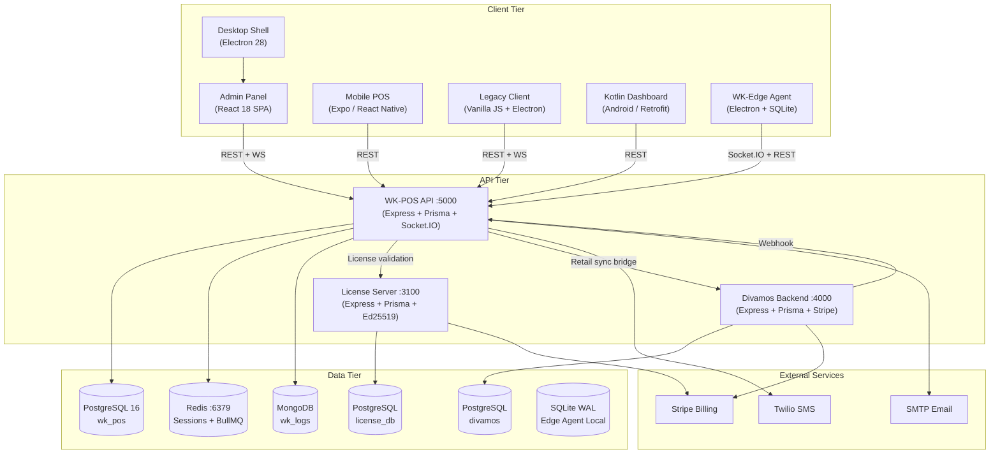
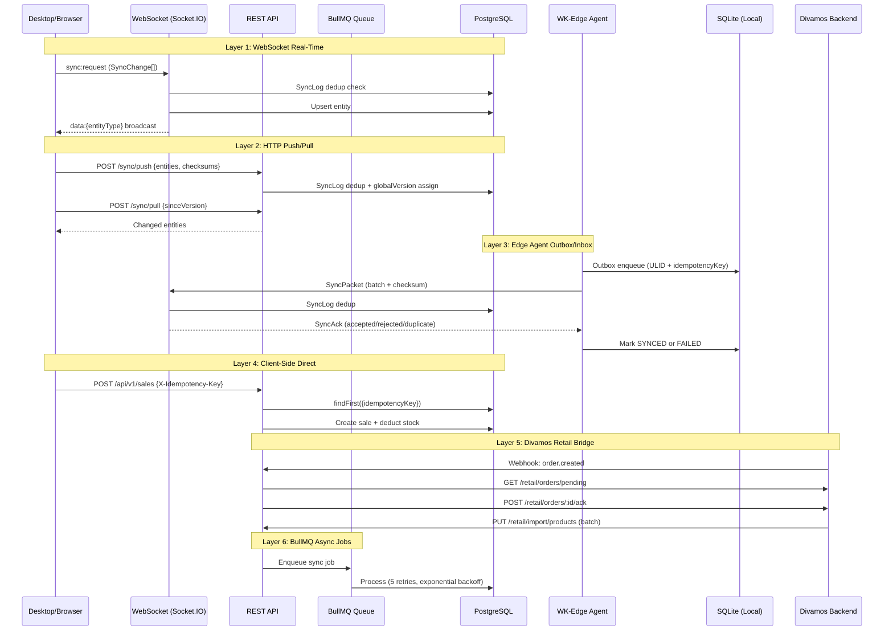

# WK POS Enterprise — System Map

**Date:** 2026-02-16  
**Author:** Enterprise Readiness Audit (Phase 0)  
**Classification:** INTERNAL — Architecture Reference

---

## 1. Application Inventory

| # | Application | Package | Version | Runtime | Port | Role |
|---|------------|---------|---------|---------|------|------|
| 1 | **WK-POS API** | `@wk/backend` | 1.0.0 | Node ≥18, Express 4.18.2, Prisma 5.22 | 5000 | Central backend — 60 modules, REST + WebSocket |
| 2 | **License Server** | `@wk-hub/license-server` | 1.0.0 | Node, Express 4.18.2, Prisma 5.7 | 3100 | License activation, metering, billing (Stripe) |
| 3 | **Divamos E-Commerce** | `backend` | 1.0.0 | Node, Express 4.18.2, Prisma 5.8 | 4000 | Storefront + admin, retail sync bridge |
| 4 | **Desktop Shell** | `wk-pos-desktop` | 1.5.0 | Electron 28, electron-vite | — | Hosts admin-panel SPA + POS mode |
| 5 | **Admin Panel** | `@wk/admin-panel` | 1.0.0 | React 18.2, Vite, Tailwind | 5173 (dev) | 57-page SPA loaded in Desktop |
| 6 | **Mobile POS** | `wk-pos-mobile` | 1.0.0 | Expo ~50, React Native 0.73 | — | Mobile POS + ServerConnectionScreen |
| 7 | **WK-Edge Agent** | `wk-edge-agent` | 1.0.0 | Electron 28, better-sqlite3, socket.io-client | — | Offline-first edge sync daemon |
| 8 | **Legacy Client** | (no package.json) | — | Vanilla JS + Electron | — | Legacy POS client (sync.js, pos.js, app.js) |
| 9 | **Kotlin Dashboard** | `wkpos-mobile-dashboard` | — | Android, Retrofit, Kotlin | — | Android management dashboard |

---

## 2. Architecture Diagram

---

## 3. Database Schema Summary

### 3.1 WK-POS Database (PostgreSQL 16)

| Metric | Value |
|--------|-------|
| Total models | **128** |
| Models with `tenantId` | **102** (79.7%) |
| Models with `branchId` | **18** (14.1%) |
| Models with `globalVersion` | **28** (21.9%) |
| Models with `clientId` + `clientSeq` | **10** (7.8%) |
| Models with `originDeviceId` | **6** (4.7%) |
| Schema lines | ~3,770 |

**Multi-tenancy:** 102/128 models scoped by `tenantId`. 26 models without tenant scope are child/join tables (SaleItem, SalePayment, ProductVariant, StockLevel, etc.) or the Tenant model itself.

**Branch scoping:** Only 18 models carry `branchId` — these are operational tables (Sale, Expense, StockLevel, Shift, etc.). StockTransfer uses `fromBranchId`/`toBranchId`.

**Sync readiness (globalVersion + clientId + clientSeq + originDeviceId):**

| Model | globalVersion | clientId | clientSeq | originDeviceId | Sync-Ready? |
|-------|:---:|:---:|:---:|:---:|:---:|
| Sale | ✅ | ✅ | ✅ | ✅ | ✅ Full |
| Customer | ✅ | ✅ | ✅ | ✅ | ✅ Full |
| Product | ✅ | ✅ | ✅ | ✅ | ✅ Full |
| ProductVariant | ✅ | ✅ | ✅ | ✅ | ✅ Full |
| StockLevel | ✅ | ✅ | ✅ | ✅ | ✅ Full |
| InventoryLog | ✅ | ✅ | ✅ | ✅ | ✅ Full |
| Branch | ✅ | ✅ | ✅ | ❌ | ⚠️ Partial |
| Employee | ✅ | ❌ | ❌ | ❌ | ⚠️ Partial |
| Expense | ✅ | ✅ | ✅ | ❌ | ⚠️ Partial |
| User | ✅ | ✅ | ✅ | ❌ | ⚠️ Partial |
| (20 others) | ✅ | ❌ | ❌ | ❌ | ❌ Version-only |

### 3.2 Divamos Database

| Metric | Value |
|--------|-------|
| Total models | **26** |
| Has `tenantId` | **0** — single-tenant |
| Has `branchId` | **0** |
| Has sync fields | **0** (except `externalId` on Product/Category/Variant for POS mapping) |
| Schema lines | ~530 |

### 3.3 License Server Database

| Metric | Value |
|--------|-------|
| Total models | **24** |
| Has `tenantId` | **7** (as string reference, no FK) |
| Has `branchId` | **0** |
| Has sync fields | **0** |
| Schema lines | ~631 |

---

## 4. API Module Inventory (WK-POS Backend)

60 feature modules organized under `wk-pos-system/server/api/src/modules/`:

| Category | Modules |
|----------|---------|
| **Core Commerce** | sales, products, categories, items, inventory, barcode, batch, pricing (via discounts/coupons) |
| **Customer** | customers, customer-groups, loyalty, giftcards |
| **Supply Chain** | suppliers, purchase-orders, stocktaking |
| **HR & Payroll** | employees, hr-payroll, attendance, shifts |
| **Financial** | accounting, payments, exchanges |
| **CRM** | crm (leads, deals, quotations, activities) |
| **Authorization** | auth, mfa, permissions, rbac, users |
| **Administration** | admin, branches, tenants, settings, preferences, feature-flags |
| **Reporting** | reports, report-builder, dashboard |
| **Integration** | integrations, website-sync, ecommerce, webhooks, webhooks-v2 |
| **Infrastructure** | sync, websocket, network, hardware, printing, notifications, concurrency, compliance, api-keys, audit, custom-fields, modifiers, parked-sales, approvals |

### Middleware Stack (14 files)

| Middleware | File | Purpose |
|-----------|------|---------|
| `auth.middleware.ts` | JWT verification, role extraction, token caching | 
| `branch-scope.middleware.ts` | Branch-level data isolation |
| `error.middleware.ts` | Global error handler |
| `idempotency.middleware.ts` | Request-level idempotency (IdempotencyKey table) |
| `license-gate.middleware.ts` | Module-level license enforcement |
| `license.middleware.ts` | License validation against license server |
| `observability.ts` | Prometheus metrics + request tracing |
| `permission.middleware.ts` | `requirePermission()` ACL checks |
| `rate-limit.middleware.ts` | Rate limiting (100 req / 15 min) |
| `rbac.middleware.ts` | Role-based access control |
| `request-context.middleware.ts` | AsyncLocalStorage context propagation |
| `tenant-isolation.middleware.ts` | Tenant-level data isolation |
| `usage-tracking.middleware.ts` | API usage metering |
| `validation.middleware.ts` | Zod schema validation |

---

## 5. Admin Panel Pages (57 pages)

Covers: Dashboard, POS, Products, Categories, Customers, Inventory, Sales/Invoices, Suppliers, Purchase Orders, Stock Control/Transfers/Taking, Branches, Users, Permissions/RBAC/ACL/ABAC, Settings, Reports/Report Builder/Scheduled, Accounting, HR/Payroll/Attendance, Shifts, CRM, Loyalty, Coupons/Discounts/Gift Cards, Commissions, API Keys, Webhooks, Audit Logs, Custom Fields, Hardware/Printers, E-commerce Bridge, Website Sync/Orders, License Management, Online Payments, Security, System Guide, Exchanges, Item/Product Movement, Retail Sync Center, Tenant Registration.

---

## 6. Sync Architecture Layers

The system has **6 independent sync layers**:

---

## 7. Configuration Storage Locations

| App | Config Mechanism | Env File | Runtime Settings |
|-----|-----------------|----------|------------------|
| WK-POS API | `config/index.ts` reads `process.env` | `.env` | `SystemSetting` table (DB) |
| License Server | `env-validation.ts` + `process.env` | `.env` | `SystemSetting` table (DB) |
| Divamos Backend | `process.env` direct reads | `.env` | `PageSettings` table (DB) |
| Desktop Shell | `electron-vite` config, IPC from main | Hardcoded in main/index.ts | SessionStorage cache |
| Admin Panel | Vite `import.meta.env` + `api.ts` | `.env` | SessionStorage cache |
| Mobile POS | `expo-secure-store` | None | `ServerConnectionScreen` UI |
| WK-Edge Agent | `agent-config.json` + env | Agent config file | Keytar (OS keychain) |
| Kotlin Dashboard | `SharedPreferences` | None | Settings screen |

---

## 8. External Integration Points

| Integration | Used By | Config Location | Protocol |
|-------------|---------|----------------|----------|
| **Stripe** | License Server, Divamos | `STRIPE_SECRET_KEY` env | HTTPS API + Webhooks |
| **Twilio SMS** | WK-POS API | `TWILIO_*` env vars | HTTPS API |
| **SMTP Email** | WK-POS API, License Server | `SMTP_*` / `EMAIL_*` env | SMTP/TLS |
| **PostgreSQL** | All 3 backends | `DATABASE_URL` env | TCP :5432 |
| **Redis** | WK-POS API | `REDIS_URL` env | TCP :6379 |
| **MongoDB** | WK-POS API | `MONGO_URI` env | TCP :27017 |
| **Network Printer** | WK-POS API (hardware module) | **Hardcoded** `192.168.1.100` | ESC/POS TCP |

---

## 9. Security Boundaries

| Boundary | Mechanism | Status |
|----------|-----------|--------|
| Authentication | JWT (10m access + 2d refresh + HttpOnly cookies) | ✅ Active |
| Multi-Factor Auth | TOTP via `otplib` | ✅ Active |
| Tenant Isolation | `tenant-isolation.middleware.ts` + `tenantId` on 102 models | ✅ Active |
| Branch Scoping | `branch-scope.middleware.ts` + `branchId` on 18 models | ✅ Active |
| Permission Control | `permission.middleware.ts` + `requirePermission()` | ✅ Active |
| RBAC | `rbac.middleware.ts` + CustomRole model | ✅ Active |
| ABAC | `ABACPolicy` model + AccessRule/AccessPolicy | ✅ Active |
| License Enforcement | `license-gate.middleware.ts` + LicenseDecision (Ed25519) | ✅ Active |
| Rate Limiting | `rate-limit.middleware.ts` (100 req / 15 min) | ✅ Active |
| API Metering | `usage-tracking.middleware.ts` + ApiUsage | ✅ Active |
| Idempotency | `idempotency.middleware.ts` + IdempotencyKey table | ⚠️ Exists but NOT wired to sale routes |
| Input Validation | `validation.middleware.ts` + Zod schemas | ✅ Active |
| Account Lockout | 5 attempts → 15 min lock | ✅ Active |
| Password Policy | JWT_SECRET ≥32 chars validated on startup | ✅ Active |
| Audit Logging | AuditLog model + PermissionAuditLog | ✅ Active |

---

## 10. Known Gaps (Cross-Reference)

| # | Gap | Severity | Phase |
|---|-----|----------|-------|
| G-001 | `idempotencyKey` optional on Sale creation | **CRITICAL** | Phase 2 |
| G-002 | SyncLog has no DB-level unique constraint | **CRITICAL** | Phase 2 |
| G-003 | 3 separate stock deduction paths, only 1 uses optimistic locking | **CRITICAL** | Phase 2 |
| G-004 | `modules/sync.service.ts → syncSale` doesn't deduct stock | **CRITICAL** | Phase 2 |
| G-005 | ~45 hardcoded IP/URL locations in source code | **HIGH** | Phase 1 |
| G-006 | BullMQ sync job key uses non-deterministic `Date.now()` | **HIGH** | Phase 2 |
| G-007 | Divamos checkout has no idempotency | **HIGH** | Phase 2 |
| G-008 | Divamos Stripe webhook doesn't check `event.id` | **HIGH** | Phase 2 |
| G-009 | IdempotencyKey middleware exists but not wired to routes | **MEDIUM** | Phase 2 |
| G-010 | 18 models with branchId vs 60 modules — branch scoping gaps likely | **MEDIUM** | Phase 3 |
| G-011 | Divamos is single-tenant — no tenantId isolation | **MEDIUM** | Phase 3 |
| G-012 | Edge Agent scaffolded but not tested end-to-end | **MEDIUM** | Phase 4 |
| G-013 | License module seed (66) not aligned with actual 60 modules | **LOW** | Phase 5 |

---

*End of System Map — Phase 0 deliverable*
