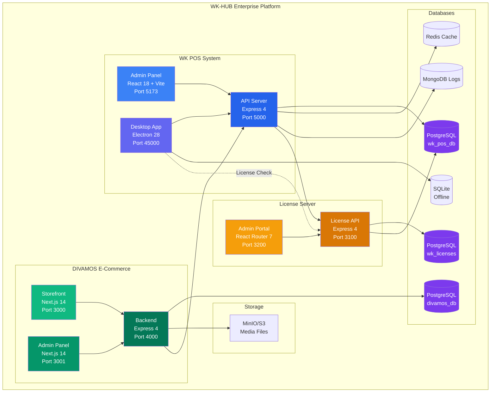
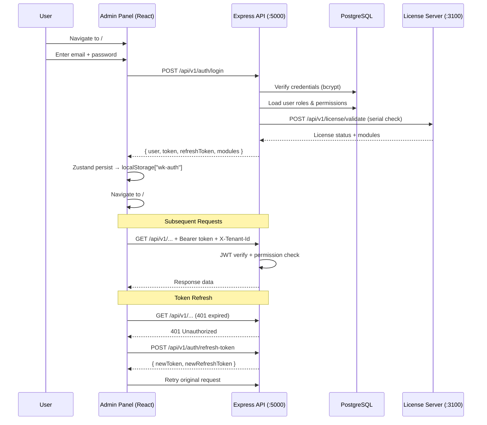
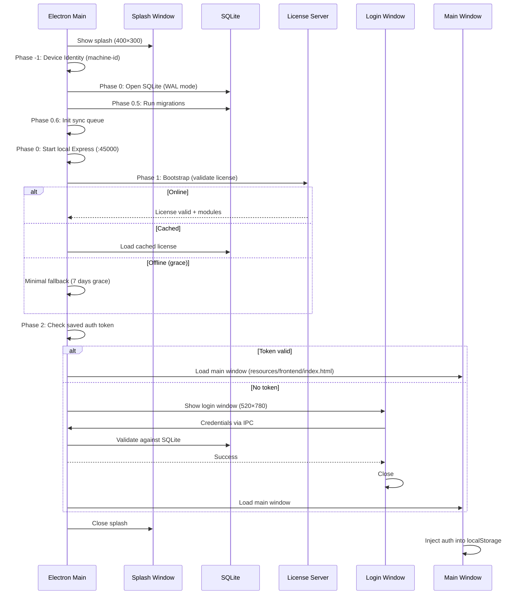
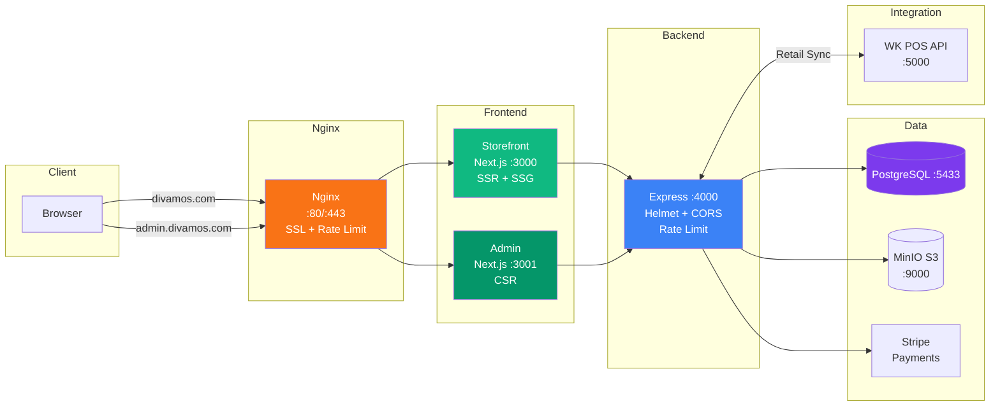
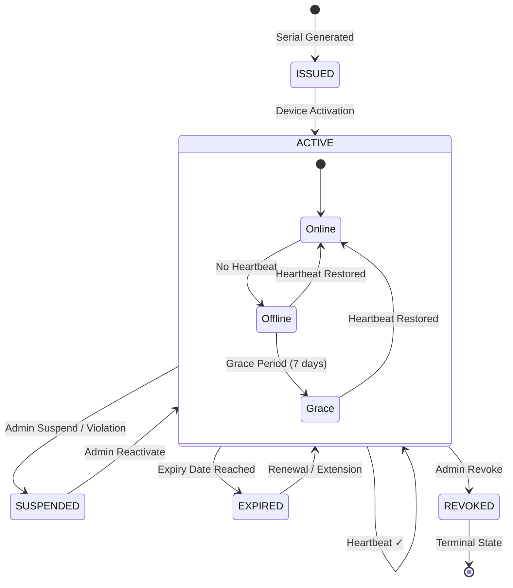
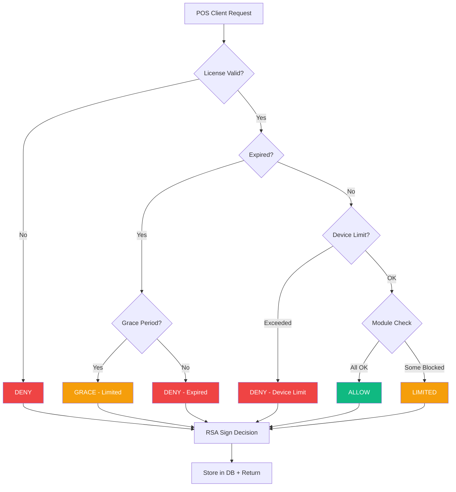
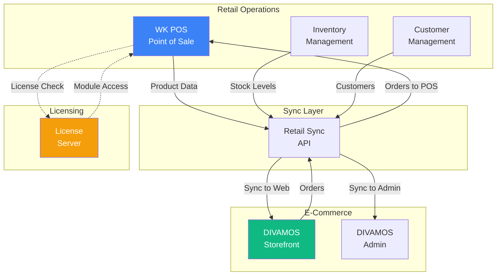
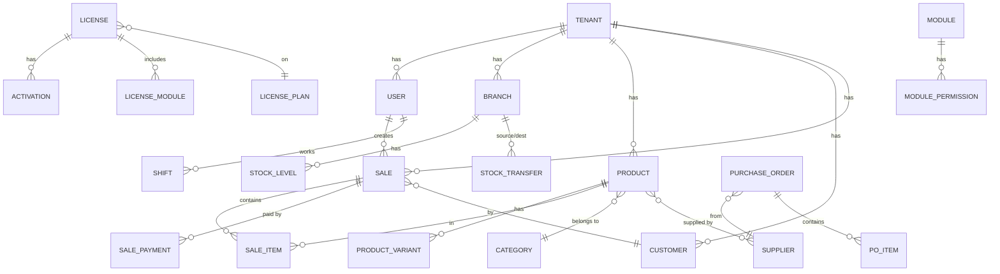
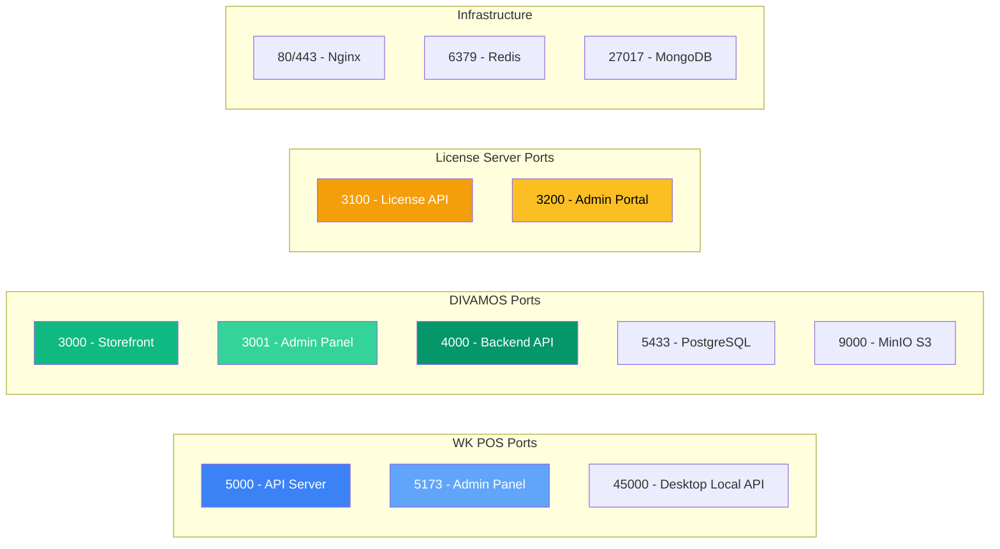

# System Architecture Diagrams

> **Audit Date:** February 12, 2026  
> **All diagrams use Mermaid.js syntax for rendering**

---

## 1. Full Platform Overview

---

## 2. WK POS — Authentication Flow

---

## 3. WK POS — Desktop Startup Sequence

---

## 4. DIVAMOS — Request Flow

---

## 5. License Server — License Lifecycle

---

## 6. License Server — Decision Authority Flow

---

## 7. Multi-System Data Flow

---

## 8. Database Schema Summary

---

## 9. Port Map

